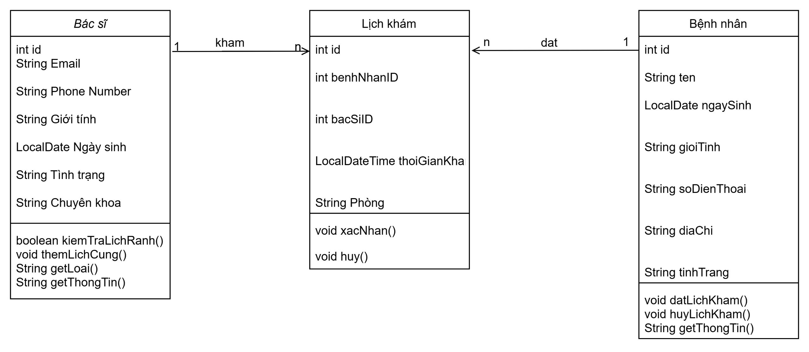
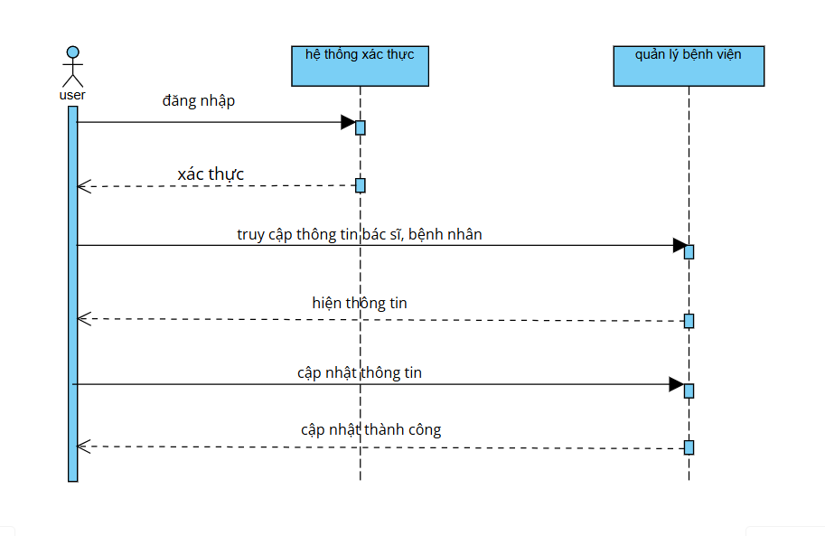
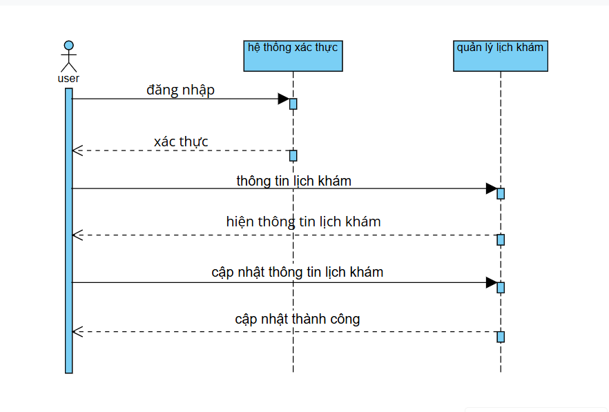
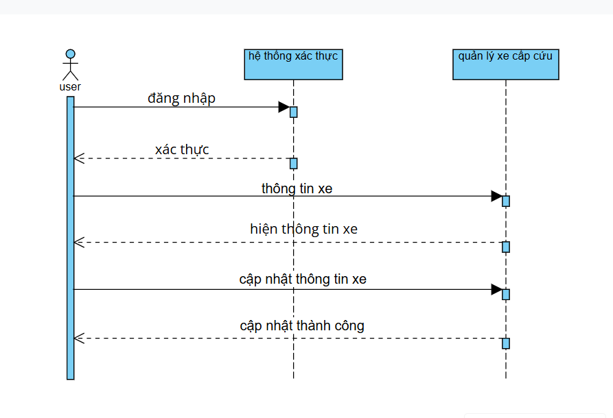

# OOP_N01_Term3_2025_K17_Group6

## **Phần mềm quản lý bệnh viện**

**Group 6 members:**
1. Vũ Hồng Đăng  
   *Github: vuhongdang18092004*  
2. Đỗ Thị Mỹ Hạnh  
   *Github: MyHanh23*  
3. Nguyễn Lệ Thu  
   *Github: nglthu*

---

## **Câu 1: Tiêu đề bài tập lớn**
Phần mềm quản lý bệnh viện.

---

##UML Dự án

---
1.1 Class diagram

---
1.2 Quản lý bệnh viện

---
1.3 Quản lý lịch khám

---
1.3 Quản lý xe cấp cứu

---
### Miêu tả phương thức: kiemTraLichKhamHomNay
- Tên phương thức: kiemTraLichKhamHomNay
- Mục đích: Kiểm tra xem ngày lịch khám có trùng với ngày hiện tại hay không.
- Tham số đầu vào:
  ngayKham(LocalDate): Ngày khám cần kiểm tra.
- Giá trị trả về:
  true nếu ngày khám là hôm nay, ngược lại trả về false
- Mô tả chi tiết:
  Phương thức sẽ lấy ngày hiện tại bằng cách gọi LocalDate.now() và so sánh nó với ngayKham. Nếu trùng nhau thì trả về true, nghĩa là lịch khám diễn ra ngày hôm nay.
- Ý nghĩa:
  Phương thức này là một phần quan trọng trong việc "lọc danh sách lịch khám hôm nay", giúp nhân viên không phải xem toàn bộ danh sachsmaf chỉ nhìn thấy những lịch khám diễn ra hôm nay. Giúp tiết kiệm thời gian và xử lý công việc hiệu quả hơn.
